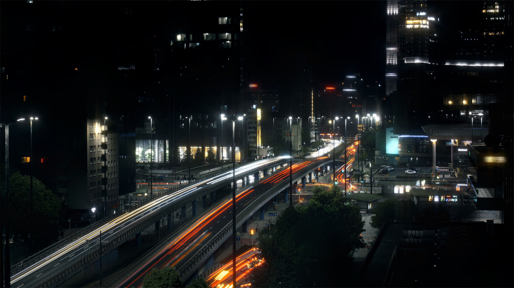
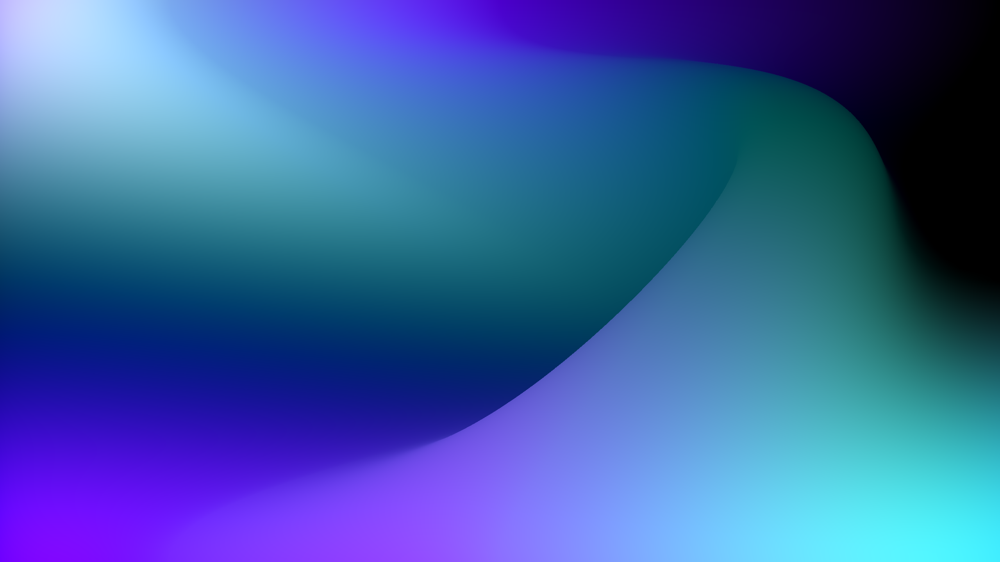

# Affinity Film Grain

Free, editable film-grain macros for **Affinity Studio 3.3**, built with **Live Procedural Texture**.

The pack includes four grain styles designed to give Affinity users a more flexible and natural-looking alternative to the native Add Noise filter.

Each macro applies an editable Live Procedural Texture directly to the layer or object you currently have selected.

The effect is automatically set to:

- **Blend Mode:** Overlay
- **Opacity:** 30%

No extra grain layer, rectangle, fill layer, or carrier layer is required.

## Included presets

### Fine 35mm

A finer and more restrained grain with reduced chroma and variation.

### Standard

The balanced default preset and the recommended general-purpose starting point.

### 16mm Coarse

Larger, rougher grain with stronger variation and more visible chroma.

### Subtle Scan

Low-strength grain intended to add a gentle scanned or printed texture without obvious noise.

## Features

- One-click Affinity macros
- Fully editable Live Procedural Texture
- Non-destructive
- Adjustable grain size
- Adjustable grain strength
- Adjustable local grain variation
- Adjustable chroma grain
- Separate RGB grain variation without excessive digital-looking color noise
- No separate Procedural Texture preset required
- No helper layers required
- Overlay blending and 30% opacity set automatically

## Requirements

Developed and tested with:

**Affinity Studio 3.3 on Windows**

The effect is intended primarily for RGB documents.

Other Affinity versions, operating systems, and document color modes may work, but have not yet been fully tested.

## Installation

1. Download `MRFilmGrain.afmacros` from the latest GitHub Release.
2. Open Affinity.
3. Open the **Library** panel.
4. Open the Library panel menu.
5. Choose **Import Macros**.
6. Select `MRFilmGrain.afmacros`.

The Film Grain macro category should now appear in your Library.

## Usage

1. Select the layer or object you want to apply grain to.
2. Open the Library panel.
3. Run one of the Film Grain macros.
4. Affinity will add a Live Procedural Texture to the selected target.
5. Double-click the Live Procedural Texture if you want to adjust the grain.

The effect starts at **Overlay / 30% opacity**.

For a stronger or weaker overall effect, the easiest control to adjust is **Opacity** at the bottom of the Live Procedural Texture window.

## Grain controls

The Procedural Texture uses six controls:

| Control | Variable | Purpose |
| --- | --- | --- |
| Grain Size | `s1` | Scale of the primary grain |
| Variation Scale | `s2` | Scale of the field controlling local grain-strength variation |
| Grain Strength | `a1` | Contrast/amplitude of the main grain |
| Grain Variation | `v` | Amount of local variation in grain strength |
| Color Grain Size | `sc` | Scale of the RGB/chroma grain |
| Color Grain | `c` | Strength of the independent RGB grain variation |

## How it works

The effect uses Affinity's Procedural Texture `noisei()` function.

Most of the grain structure is shared between the red, green, and blue channels, which keeps the grain predominantly neutral.

A smaller independently offset noise component is then added to each RGB channel to introduce subtle color variation.

A second shared noise field modulates the strength of the primary grain, creating local variation without adding a separate visible cloudy noise layer.

Conceptually:

`50% gray + primary grain × local grain variation + subtle independent RGB grain`

## Procedural Texture equations

The effect uses three equations, one for each RGB channel.

### Red

```text
0.5+((noisei(vec2(rx/s1,ry/s1))-0.5)*a1*(1+(noisei(vec2((rx+23)/s2,(ry+47)/s2))-0.5)*v))+((noisei(vec2((rx+11)/sc,(ry+29)/sc))-0.5)*c)
```

### Green

```text
0.5+((noisei(vec2(rx/s1,ry/s1))-0.5)*a1*(1+(noisei(vec2((rx+23)/s2,(ry+47)/s2))-0.5)*v))+((noisei(vec2((rx+37)/sc,(ry+7)/sc))-0.5)*c)
```

### Blue

```text
0.5+((noisei(vec2(rx/s1,ry/s1))-0.5)*a1*(1+(noisei(vec2((rx+23)/s2,(ry+47)/s2))-0.5)*v))+((noisei(vec2((rx+61)/sc,(ry+43)/sc))-0.5)*c)
```

## Preset values

| Preset | `s1` | `s2` | `a1` | `v` | `sc` | `c` |
| --- | ---: | ---: | ---: | ---: | ---: | ---: |
| Fine 35mm | 0.75 | 1.20 | 0.55 | 0.50 | 0.70 | 0.14 |
| Standard | 1.00 | 1.50 | 0.65 | 0.70 | 0.90 | 0.20 |
| 16mm Coarse | 1.50 | 2.20 | 0.75 | 0.90 | 1.35 | 0.24 |
| Subtle Scan | 0.90 | 1.40 | 0.35 | 0.40 | 0.85 | 0.08 |

All four macros default to:

- **Blend Mode:** Overlay
- **Opacity:** 30%

## Why `noisei()`?

Earlier versions were tested using Affinity's `noisecb()` function.

While `noisecb()` could produce attractive texture, it also showed more obvious cellular/lattice-like structure and larger repeating patterns at several zoom levels.

`noisei()` produced a more natural-looking grain structure and avoided those obvious repeating patterns, so it became the basis of the final effect.

## Before and after previews

These are supplied full-resolution examples. Click an image to view it at its original 2560 × 1440 size, and inspect at 100% zoom to judge fine grain. These examples are pretty subtle - the effect can be pushed much farther than this.

| Scene | Before | After |
| --- | --- | --- |
| Bridge | [](images/BridgeNoGrain.jpg) | [](images/BridgeGrain.png) |
| Gradient | [](images/GradientNoGrain.png) | [](images/GradientGrain.png) |
| Skyline | [](images/SkyLineNoGrain.png) | [](images/SkyLineGrain.png) |

## Download

Download `MRFilmGrain.afmacros` from the latest GitHub Release and import it through Affinity's Library panel.

## License

MIT License.

## Disclaimer

This is an independent community project and is not affiliated with or endorsed by Affinity.

Affinity and related product names and trademarks belong to their respective owners.
